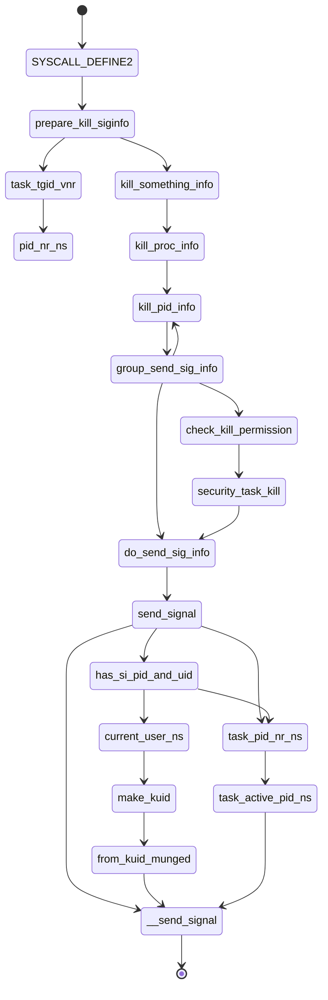

[toc]

# 问题

在容器内给容器内的init进程发送SIGTERM信号，init进程会不会被杀死，发送SIGKILL信号呢？在容器外发送信号呢？为什么？

*问题来源：极客时间*

# 相关理论知识

## 信号相关

- SIGKILL和SIGTERM信号都是Linux信号，SIGKILL和SIGSTOP属于不能被忽略和handle的内核信号，主要提供给内核进程和root用户进行特权操作。
- 使用kill命令的时候，缺省状态下，kill 1 向init进程发送SIGTREM信号
- Ctrl+C发送的是SIGING信号

## 编程语言的signal

很多编程语言对不同的信号做了handle处理，使用C语言需要自己做处理（除了SIGKILL和SIGSTOP之外，他们有内核提供的默认的handle）。下列是Python和Go语言对部分signal的处理：

|         | Python                                                       | Golang                                                       |
| ------- | ------------------------------------------------------------ | ------------------------------------------------------------ |
| SIGQUIT | 执行默认操作，进程退出并将内存中的信息转存到硬盘（核心转储） | 以堆栈转储方式退出                                           |
| SIGCHLD | 终止子进程                                                   | 子进程退出                                                   |
| SIGHUP  | 在控制终端上检测到挂起或控制进程的终止                       | 程序退出                                                     |
| SIGTERM | 终结                                                         | 程序退出                                                     |
| SIGPIPE | 写入到没有读取器的管道，默认忽略                             | 在标准输出或标准错误上写入损坏的管道将导致程序退出，而在其他的文件描述符上写入不会采取任何操作，但是会抛出EPIPE错误 |
| SIGING  | 引发 [`KeyboardInterrupt`](https://docs.python.org/zh-cn/3/library/exceptions.html#KeyboardInterrupt) |                                                              |

关于signal信号的处理，可以查看下列文档：

- Python：https://docs.python.org/zh-cn/3/library/signal.html?highlight=signal#signal.SIGPIPE

- Golang：https://pkg.go.dev/os/signal

## 容器中的init进程

- 容器中的init进程是pid为1的进程
- 当容器以单进程运行时，init进程为容器内执行的进程
- 当容器以多进程运行时，会启动一个管理进程，该进程即为容器的init进程
- 在容器内发送SIGKILL命令，内核将会屏蔽掉该信号（与在跟命名空间中一致），防止其他进程杀掉init进程
- 在容器外杀掉init进程后，再向容器内添加进程将会导致ENOMEN错误，因为进程已经终止
- init进程是容器内所有孤儿进程的父进程

# 当使用kill命令时，内核做了什么（源码分析）

## 寻找kill系统调用

Linux系统调用由原本的sys_XXXX换成了SYSCALL_DEFINE，故在/kernel/signal.c文件下，寻找SYSCALL_DEFINE，找到SYSCALL_DEFINE2(kill, pid_t, pid, int, sig)，代码如下：

```c
/**
 *  sys_kill - send a signal to a process
 *  @pid: the PID of the process
 *  @sig: signal to be sent
 */
SYSCALL_DEFINE2(kill, pid_t, pid, int, sig)
{
	struct kernel_siginfo info; // info是signal的结构体

	prepare_kill_siginfo(sig, &info);

	return kill_something_info(sig, &info, pid);
}
```

关于SYSCALL_DEFINEx，可以在https://blog.csdn.net/hxmhyp/article/details/22699669文章里面看到。

关于kernel_siginfo，可以看如下代码：

```c
typedef struct kernel_siginfo {
	__SIGINFO;
} kernel_siginfo_t;
```

关于__SIGINFO：

```c
struct {				\
	int si_signo; /* Signal number */
	int si_errno；/* An errno value */
	int si_code; // 产生信号的原因
	union __sifields _sifields;
}
```

简而言之，__SIGINFO就是标识signal的一些信息。

接下来我们来看看```prepare_kill_siginfo(sig, &info);```方法做了什么：

```c
static inline void prepare_kill_siginfo(int sig, struct kernel_siginfo *info)
{
	clear_siginfo(info);
	info->si_signo = sig; // 传入的信号
	info->si_errno = 0;
	info->si_code = SI_USER; // 产生自用户空间
	info->si_pid = task_tgid_vnr(current); // 主要是从当前namespace 中找到对应的pid号。
	info->si_uid = from_kuid_munged(current_user_ns(), current_uid()); // 返回0，也就是root用户
}
```

关于```info->si_code = SI_USER; ```中的SI_USER，在内核源码```\include\uapi\asm-generic\siginfo.h```可以看到Linux定义的一些信号相关的信息。下列贴出部分：

```c
/*
 * si_code values
 * Digital reserves positive values for kernel-generated signals.
 */
#define SI_USER		0		/* sent by kill, sigsend, raise 由kill、raise等发送的*/
#define SI_KERNEL	0x80		/* sent by the kernel from somewhere 从内核某处发送 */
#define SI_QUEUE	-1		/* sent by sigqueue */
#define SI_TIMER	-2		/* sent by timer expiration */
#define SI_MESGQ	-3		/* sent by real time mesq state change */
#define SI_ASYNCIO	-4		/* sent by AIO completion */
#define SI_SIGIO	-5		/* sent by queued SIGIO */
#define SI_TKILL	-6		/* sent by tkill system call */
#define SI_DETHREAD	-7		/* sent by execve() killing subsidiary threads */
#define SI_ASYNCNL	-60		/* sent by glibc async name lookup completion */

#define SI_FROMUSER(siptr)	((siptr)->si_code <= 0)
#define SI_FROMKERNEL(siptr)	((siptr)->si_code > 0)
```

由此可以看到，这里的标识表示SI_USER是由kill发出的。

接下来可以看task_tgid_vnr(current)；首先是current：

```c
/*
 * We don't use read_sysreg() as we want the compiler to cache the value where
 * possible.
 */
static __always_inline struct task_struct *get_current(void)
{
	unsigned long sp_el0;

	asm ("mrs %0, sp_el0" : "=r" (sp_el0));

	return (struct task_struct *)sp_el0;
}

#define current get_current() // 获取当前运行的task_struct
```

它是获取当前运行的task_struct，我们都知道，在Linux里面task_struct表示一个进程描述符，存储了进程相关的一些信息。

然后我们看一下task_tgid_vnr方法，一路追踪到底，可以看到：

```c
pid_t __task_pid_nr_ns(struct task_struct *task, enum pid_type type,
			struct pid_namespace *ns)
{
	pid_t nr = 0;  // pid_t 宏定义 int 变量

	rcu_read_lock(); // 申请rcu锁
	if (!ns)
		ns = task_active_pid_ns(current);
	nr = pid_nr_ns(rcu_dereference(*task_pid_ptr(task, type)), ns);
	rcu_read_unlock(); // 释放rcu锁

	return nr;
}
```

task_active_pid_ns方法：\linux\kernel\pid.c

```c
struct pid_namespace *task_active_pid_ns(struct task_struct *tsk)
{
	return ns_of_pid(task_pid(tsk));
}
```

接着继续ns_of_pid方法：\include\linux\pid.h

```c
static inline struct pid_namespace *ns_of_pid(struct pid *pid)
{
	struct pid_namespace *ns = NULL;
	if (pid)
		ns = pid->numbers[pid->level].ns;
	return ns;
}
```

这里返回pid所在的命名空间。

然后是pid_nr_ns：\include\linux\pid.h

```c
pid_t pid_nr_ns(struct pid *pid, struct pid_namespace *ns)
{
	struct upid *upid;
	pid_t nr = 0;

	if (pid && ns->level <= pid->level) {
		upid = &pid->numbers[ns->level];
		if (upid->ns == ns)
			nr = upid->nr;
	}
	return nr;
}
```

主要是从当前namespace 中找到对应的pid号。

OK，所以prepare_kill_siginfo方法获取kernel_siginfo相关的信息并进行初始化。

接下来我们来看最关键的kill_something_info：

```c
static int kill_something_info(int sig, struct kernel_siginfo *info, pid_t pid)
{
	int ret;

	if (pid > 0)
		return kill_proc_info(sig, info, pid);
	...
}
```

kill_proc_info:

```c
static int kill_proc_info(int sig, struct kernel_siginfo *info, pid_t pid)
{
	int error;
	rcu_read_lock();
	error = kill_pid_info(sig, info, find_vpid(pid));
	rcu_read_unlock();
	return error;
}
```

首先是find_vpid:

```c
struct pid *find_vpid(int nr)
{
	return find_pid_ns(nr, task_active_pid_ns(current));
}
```

task_active_pid_ns刚刚我们已经讲过，所以这里是返回当前进程所在的命名空间。

而find_pid_ns作用是找到其所属的struct pid。

然后我们进入kill_pid_info：

```c
int kill_pid_info(int sig, struct kernel_siginfo *info, struct pid *pid)
{
	int error = -ESRCH;
	struct task_struct *p;

	for (;;) {
		rcu_read_lock();
		p = pid_task(pid, PIDTYPE_PID);
		if (p)
			error = group_send_sig_info(sig, info, p, PIDTYPE_TGID);
		rcu_read_unlock();
		if (likely(!p || error != -ESRCH))
			return error;

		/*
		 * The task was unhashed in between, try again.  If it
		 * is dead, pid_task() will return NULL, if we race with
		 * de_thread() it will find the new leader.
		 */
	}
}
```

pid_task：

```c
struct task_struct *pid_task(struct pid *pid, enum pid_type type)
{
	struct task_struct *result = NULL;
	if (pid) {
		struct hlist_node *first;
		first = rcu_dereference_check(hlist_first_rcu(&pid->tasks[type]),
					      lockdep_tasklist_lock_is_held());
		if (first)
			result = hlist_entry(first, struct task_struct, pid_links[(type)]);
	}
	return result;
}
```

根据一致的struct pid找到struct task_struct。

group_send_sig_info：

```c
int group_send_sig_info(int sig, struct kernel_siginfo *info,
			struct task_struct *p, enum pid_type type)
{
	int ret;

	rcu_read_lock();
	ret = check_kill_permission(sig, info, p); 
    // 检查是否是有效信号，检测是否来自用户或内核
    // 来自用户需要记录审计日志后返回0，来自内核直接返回0
	rcu_read_unlock();

	if (!ret && sig) // 如果是有效信号，调用do_send_sig_info
		ret = do_send_sig_info(sig, info, p, type);

	return ret;
}
```

我们来看看check_kill_permission的调用链：

```c
/*
 * Bad permissions for sending the signal
 * - the caller must hold the RCU read lock
 */
static int check_kill_permission(int sig, struct kernel_siginfo *info,
				 struct task_struct *t)
{
	struct pid *sid;
	int error;

	if (!valid_signal(sig))  // return sig <= _NSIG ? 1 : 0; _NSIG == 64 这里检测是否是一个有效的信号
		return -EINVAL; // EINVAL 宏定义 22

	if (!si_fromuser(info)) // si_fromuser判断是否是来自用户，是返回True
		return 0;

	error = audit_signal_info(sig, t); // 记录审计日志，这里始终返回0
	if (error)
		return error;

	if (!same_thread_group(current, t) && // current和当前进程信号是否一致
	    !kill_ok_by_cred(t)) {
		switch (sig) {
		case SIGCONT:
			sid = task_session(t);
			/*
			 * We don't return the error if sid == NULL. The
			 * task was unhashed, the caller must notice this.
			 */
			if (!sid || sid == task_session(current))
				break;
			fallthrough;
		default:
			return -EPERM;
		}
	}

	return security_task_kill(t, info, sig, NULL); // 返回0
}
```

si_fromuser：

```c
static inline bool si_fromuser(const struct kernel_siginfo *info)
{
	return info == SEND_SIG_NOINFO || // SEND_SIG_NOINFO为SI_USER，这里info.si_code为SI_USER故为True
		(!is_si_special(info) && SI_FROMUSER(info)); 
    	// is_si_special函数关键处为info <= SEND_SIG_PRIV; SEND_SIG_PRIV即SI_KERNEL表示由内核发送
    	// 故is_si_special(info)为True，即!is_si_special(info)为false
    	// SI_FROMUSER为下列宏定义
    	// #define SI_FROMUSER(siptr)	((siptr)->si_code <= 0)
    	// 故这里SI_FROMUSER(info)为True
    	// 综上所述，si_fromuser判断sig是否来自用户
}
```

进入audit_signal_info(sig, t)调用：

```c
/**
 * audit_signal_info - record signal info for shutting down audit subsystem
 * @sig: signal value
 * @t: task being signaled
 *
 * If the audit subsystem is being terminated, record the task (pid)
 * and uid that is doing that.
 */
int audit_signal_info(int sig, struct task_struct *t)
{
	kuid_t uid = current_uid(), auid;

	if (auditd_test_task(t) && // auditd_test_task判断是否是注册的审计进程，是返回1，否返回0
	    (sig == SIGTERM || sig == SIGHUP ||
	     sig == SIGUSR1 || sig == SIGUSR2)) { // 如果sig是SIGTERM、SIGHUP或用户自定义的SIGUSR1和SIGUSR2
		audit_sig_pid = task_tgid_nr(current);
		auid = audit_get_loginuid(current);
		if (uid_valid(auid))
			audit_sig_uid = auid;
		else
			audit_sig_uid = uid;
		security_task_getsecid(current, &audit_sig_sid);
	}

	return audit_signal_info_syscall(t); // 始终返回0
}
```

auditd_test_task：

```c
/**
 * auditd_test_task - Check to see if a given task is an audit daemon
 * @task: the task to check
 *
 * Description:
 * Return 1 if the task is a registered audit daemon, 0 otherwise.
 */
int auditd_test_task(struct task_struct *task)
{
	int rc;
	struct auditd_connection *ac;

	rcu_read_lock();
	ac = rcu_dereference(auditd_conn); // 
	rc = (ac && ac->pid == task_tgid(task) ? 1 : 0); 
    // task_tgid通过task_struct获取pid结构体，而ac是Linux audit守护进程，负责将审计记录写入磁盘，使用ausearch或aureport实用程序查看日志。
	rcu_read_unlock();

	return rc;
}
```

然后回到group_send_sig_info函数，我们聚焦到do_send_sig_info函数：

```c
int do_send_sig_info(int sig, struct kernel_siginfo *info, struct task_struct *p,
			enum pid_type type)
{
	unsigned long flags;
	int ret = -ESRCH;

	if (lock_task_sighand(p, &flags)) { // 获取信号处理函数锁
		ret = send_signal(sig, info, p, type);
		unlock_task_sighand(p, &flags);
	}

	return ret;
}
```

调用send_signal：

```c
static int send_signal(int sig, struct kernel_siginfo *info, struct task_struct *t,
			enum pid_type type)
{
	/* Should SIGKILL or SIGSTOP be received by a pid namespace init? */
    // pid namespace init是否需要接收SIGKILL or SIGSTOP
	bool force = false;

	if (info == SEND_SIG_NOINFO) {
		/* Force if sent from an ancestor pid namespace */
        // 如果来自祖先用户空间，则强制发送
		force = !task_pid_nr_ns(current, task_active_pid_ns(t));
	} else if (info == SEND_SIG_PRIV) {
		/* Don't ignore kernel generated signals */
        // 来自内核的信号不会被忽略
		force = true;
	} else if (has_si_pid_and_uid(info)) {
		/* SIGKILL and SIGSTOP is special or has ids */
		struct user_namespace *t_user_ns;

		rcu_read_lock();
		t_user_ns = task_cred_xxx(t, user_ns);
		if (current_user_ns() != t_user_ns) {
			kuid_t uid = make_kuid(current_user_ns(), info->si_uid);
			info->si_uid = from_kuid_munged(t_user_ns, uid);
		}
		rcu_read_unlock();

		/* A kernel generated signal? */
		force = (info->si_code == SI_KERNEL);

		/* From an ancestor pid namespace? */
		if (!task_pid_nr_ns(current, task_active_pid_ns(t))) {
			info->si_pid = 0;
			force = true;
		}
	}
	return __send_signal(sig, info, t, type, force);
}
```

task_pid_nr_ns我们刚刚已经讲过了，让我们再讲一遍：

```c
pid_t __task_pid_nr_ns(struct task_struct *task, enum pid_type type,
			struct pid_namespace *ns)
{
    //参数中的 ns = task_active_pid_ns(t)是返回目标进程的namespace
    // 这里的task是current，也就是当前进程的task_struct
	pid_t nr = 0;  // pid_t 宏定义 int 变量

	rcu_read_lock(); // 申请rcu锁
	if (!ns)
		ns = task_active_pid_ns(current); // 返回pid也就是调用kill的进程所在的命名空间
	nr = pid_nr_ns(rcu_dereference(*task_pid_ptr(task, type)), ns); // 从当前namespace 中找到对应的pid号
	rcu_read_unlock(); // 释放rcu锁

	return nr;
}
```

然后来到pid_nr_ns：

```c
pid_t pid_nr_ns(struct pid *pid, struct pid_namespace *ns)
{
	struct upid *upid;
	pid_t nr = 0;

	if (pid && ns->level <= pid->level) {
		upid = &pid->numbers[ns->level]; // 获取和目标进程处于同一level的namespace
		if (upid->ns == ns) // 当前进程和目标进程是不是同一个命名空间
			nr = upid->nr;
	}
	return nr;
}
```

在这里，我们使用kill命令发送signal的进程和目标进程之间的关系存在3种情况：

- 处于同一个namespace：
  - 那么也就是&ns.level==&pid.level，而且&pid->numbers[ns->level] == ns，最终结果返回当前进程pid
- 当前进程处于目标进程的父namespace：
  - 则&pid.level < &ns.level，最终返回0

所以由于pid > 0，结果!task_pid_nr_ns(current, task_active_pid_ns(t))情况如下：

- 处于同一个namespace：False
- 当前进程处于目标进程的父namespace：True

所以，如果当前进程处于目标进程的祖先namespace，那这个信号一定会被传递给init进程。



