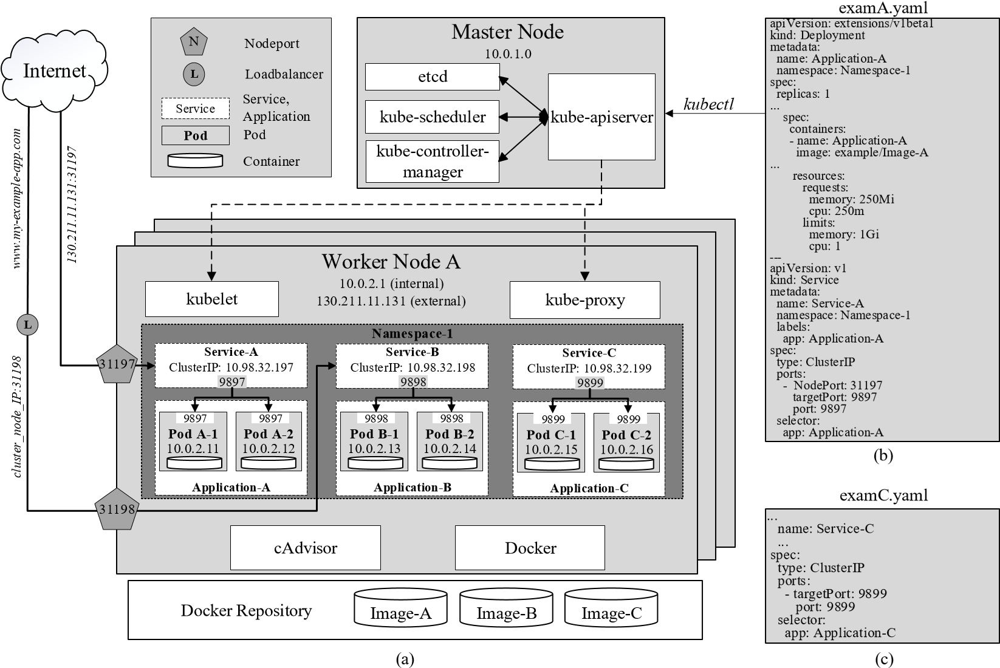
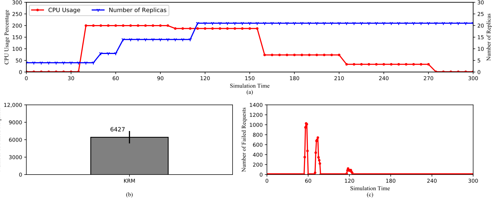

# 用于弹性容器编排的Kubernetes中的水平Pod自动扩缩容

**作者**：Thanh-Tung Nguyen	, Yu-Jin Yeom 1 , Taehong Kim 1,* , Dae-Heon Park 2,*  and Sehan Kim
**原文**：https://pdfs.semanticscholar.org/a6e5/53a4f59d737d802cebdce7e114c5d62f728c.pdf

[TOC]

## 摘要

Kubernetes是一个开源的容器编排平台，通过自动扩缩容机制（水平、垂直和集群自动扩缩容）实现高可用性和可拓展性。其中HPA通过动态拓展和所见资源单元（Pod）的数量来帮助提供不间断的服务，而无需通过重新启动整个系统。Kubernetes监控默认的资源指标，包括主机及其Pod的CPU和内存使用情况。另一方面，有Prometheus等外部软件提供的自定义指标是可定制的，可以监控各种指标。在本文中，我们通过各种实验来研究HPA，以提供有关操作行为的关键知识。我们还讨论了Kubernetes资源指标（KRM）和Prometheus自定义指标（PCM）之间的本质区别，以及他们如何影响HPA的性能。最后，我们为将来使用Kubernetes的研究人员，开发人员和系统管理员提供了有关如何优化HPA性能的更深入的见解和经验教训。

## 1、前言

近年来，随着云计算和后期边缘计算的快速出现，虚拟化技术已经成为学术研究和工业发展的轰动话题，因为他们使用Amazon Web Services、GCP、Microsoft Azure等云平台能实现大规模的弹性。新兴的虚拟化技术之一是容器化技术，其中配备随时可部署的应用程序组件的轻量级操作系统被打包到一个自给自足的容器中，准备在支持多租户的主机上运行。在主机系统中，不同的容器在同一主机操作系统和同一内核中一起运行，这有助于降低存储要求，并允许他们主机操作系统相比实现接近本机的性能。

由于容器可以大规模部署，因此对在部署、拓展和管理方面高度自动化的容器编排平台有着巨大的需求。在各种编排平台中，包括Docker Swarm、Amazon Elastic Container Service、Red Hat OpenShift Container Platform，Kubernetes已成为其受欢迎的事实上的标准。他是一个开源平台，可以轻松打包和运行容器化应用程序、工作负载和服务，并提供用于操作可拓展分部署系统的框架，此外，容器化应用程序具有在任何类型的操作系统和云基础架构上运行的可移植性。Kubernetes使用Docker作为基础环境来运行可以指且自给自足的容器，其实例化称为Docker镜像，它提供了一个控制平面，用于管理和安排这些容器在其主机集群（节点）上运行，具体取决于其可用资源和每个容器的特定要求。

在Kubernetes中，最重要的功能之一是自动伸缩，因为它允许容器化应用程序和服务在没有人干预的情况下弹性运行。Kubernetes提供了三种类型的自动伸缩器：

- HPA，根据各种要求调整执行和资源单元（Pod）的数量来支持高可用性。触发后HPA会出创建新的Pod来共享工作负载，而不会影响当前在集群内运行的现有Pod。
- VPA，直接更改Pod的规格，例如请求的资源，并维护工作Pod的数量。因此，他需要重新启动这些Pod，从而中断应用程序和服务的连续性。
- 集群自动伸缩（CA），增加了不再能够在现有POD上调度POD的节点数。目前CA仅适用于GCP和AWS等商业云平台。

为了支持自动扩缩容，Kubernetes会监控Pod、应用程序、主机和集群统计信息（指标）。当这些指标达到特定阈值时，将自动触发扩缩容程序。虽然Kubernetes默认提供资源指标，但是他们的监控目标仅限于Pod和主机的CPU和内存的使用情况。因此，可以在外部软件的帮助下添加可定制（自定义）指标，提高HPA的性能和灵活性。在本文中，我们研究了Prometheus提供的自定义指标，Prometheus是由云原生计算基金会运行的开源项目。

已经有几项工作旨在提高Kubernetes自动扩缩容的性能。

例如，参考文献15，16中提出了改善CA和VPA的技术，参考文献17，18中则侧重于提高HPA和资源检测的性能。然而他们还没有深入基础知识。例如，需要解决诸如“Kubernetes HPA如何对不同的类型做出反应？”、“不同指标抓取周期对Kubernetes有何影响？”或“仅监视CPU和内存使用率是否满足HPA？”之类的问题。此外，有关Kubernetes及其自动扩缩器的文档可以在官方文档、网站和互联网的其他几个来源上找到。但是他们是从功能角度编写的，或者只是提供有关如何安装和运行Kubernetes的教程。对Kubernetes的运营行为缺乏全面的基本分析。因此，在本文中，我们专注于HPA，并寻求通过以下贡献来提高关于有关该主题的知识：

- 首先，我们通过测试平台上的各种实现，从拓展趋势，指标搜集，请求处理，集群大小，抓取时间和延迟等方面评估HPA。我们对结果的全面分析提供了官方网站和其他来源所没有的知识和见解。

- 其次，除了Kubernetes的默认资源指标外，我们还使用Prometheus Custom Metric评估HPA。通过了解这两种指标之间的差异，读者可以更牢固掌握HPA的运行行为。
- 最后，我们提供从实验和分析中获得的实践经验。它们可以作为基础知识，以便研究人员，开发人员和系统管理员可以做出明智的决策，以优化HPA的性能以及Kubernetes集群中的服务质量。

本文的其余部分组织如下。第 2 部分讨论了有关 Kubernetes 和自扩展研究的现有文献。第 3 部分分析了 Kubernetes 的体系结构，而第 4 部分则彻底讨论了 HPA、不同的指标以及 Reiness Probe 的使用，这有助于读者在进行性能分析之前更好地了解 Kubernetes 和 HPA。第5节从各种实验场景的结果中得出了有关HPA性能的经验教训。最后，第6节总结了本文。

## 2、相关工作

Kubernetes最初由Google开发，后来转移到CNCF [14]，作为在云数据中心高效部署，管理和扩展容器化应用程序的解决方案。但是，由于它是一个开源项目，因此可以配置和修改Kubernetes作为坚实的基础，可以在其上构建和开发满足特定需求的其他平台。Reference [19] 的作者认为，当前版本的 Kubernetes 调度程序只考虑了可虚拟化的物理基础设施，包括 CPU 和内存使用率，这才有逻辑意义。但是，从公司的角度来看，为了提高数据中心的效率，还需要考虑其他条件，例如地理位置，电力基础设施和业务流程。因此，作者提出了一种名为Edgetic的增强调度程序，它可以在性能和功耗方面预测Pod的最佳位置。

在参考文献[15]中，瑟古德和列侬讨论了许多场景，包括智能家居环境，其中有大量的输入设备，而家庭成员等用户数量经常波动。这就意味着当所有现有节点都繁忙时，需要 HPA 和更高版本的 CA。然而，目前，默认的Kubernetes CA仅由GCP [2]等云平台提供商提供，因此他们为Kubernetes提出了一种称为自由/开源软件（FOSS）的弹性CA解决方案。此解决方案采用 VMware ESXi 主机作为节点和虚拟机工具，包括用于 CA 操作的 vCenter、Foreman。具体而言，当任何节点达到 CPU 或内存阈值时，vCenter 服务器都会创建虚拟机警报，然后执行 bash 脚本，通过 Foreman 创建新的虚拟机节点。

在参考文献[16]中，作者提出了一种名为基于资源利用率的自动缩放系统（RUBAS）的无中断VPA解决方案，其中包含容器迁移。他们认为，资源可能被高估，导致利用率低下。因此，RUBAS 计算 VPA 的实际所需资源。此外，作者试图通过使用用户空间中的检查点还原（CRIU）创建检查点映像来解决必须在VPA中重新启动容器和容器的问题。Rossi [20]提出了一种用于水平和垂直自动缩放的强化学习模型。它旨在确保应用程序所需的响应时间。Reference [21]的作者开发了一种混合自适应自动缩放器Libra。它还考虑了采用传统HPA的应用的最佳资源分配。Libra本质上是VPA和HPA的控制回路。在第一阶段，Libra 使用金丝雀应用程序计算适当的 CPU 限制，并根据此新的 CPU 限制调整生产应用程序的 Pod 数量。之后，如果负载达到极限，则重复循环。

在参考文献[22，23]中，作者认为Kubernetes目前正在使用通过cAdvisor从/cgroup虚拟文件系统收集的相对指标。这些指标可能与处理器中的实际 CPU 使用率不同，后者可以从 /proc 文件系统中收集。这种差异可能导致低估所需资源。因此，作者提出了CPU密集型应用程序的相对指标和绝对指标之间的相关模型，用于纠正Kubernetes收集的相对指标，以提高HPA的性能。考虑到类似的目标，参考文献[24]的作者提出了几个影响因素，例如保守常数，它实际上为度量波动创造了一个缓冲区。仅当指标值超出此区域时，才会执行 HPA 操作。另一个因素是连续缩放操作之间的适应间隔。这样可以减少指标值波动时不必要的缩放。

在参考文献 [25，26] 中，作者将 Kubernetes 应用于容器化雾计算应用程序的资源配置中。提出一种网络感知调度算法，该算法考虑了节点的CPU和RAM容量、设备类型和地理位置等网络基础设施，以做出配置决策。例如，此算法在调度时间关键型应用程序的实例时可以考虑往返延迟。另一个基于 Kubernetes 的雾计算平台，用于管理地理上分散的容器，在参考文献 [27] 中提出。在本文中，作者设计了一种名为Autoscaling Broker（AS Broker）的服务，以获取原始指标并根据CPU和内存使用情况计算HPA的最佳副本数，同时减少应用程序的响应时间。在参考文献 [12] 中，Chang 等人介绍了一个基于 Kubernetes 的云监控平台，该平台提供基于资源利用率和应用程序 QoS 指标的动态资源配置算法。在此平台上，使用Heapster v.0.19.1 [28]，InfluxDB v.0.9.4.1 [29]和Grafana v.2.1.0 [30]收集并显示资源指标，而应用程序的响应时间则使用Apache JMeter计算[31]。此数据被聚合并输入到一个配置算法中，该算法实质上是计算和获取 Pod 的数量。Jin-Gang等人在参考文献中提出了一种用于统一通信服务器的预测HPA算法[18]。该算法的反应式扩展部分与 Kubernetes 的当前算法相同。另一方面，该算法还采用自动回归集成和移动平均（ARIMA）模型来预测未来的工作负载，或HTTP请求的数量[32]来触发HPA和升级。

Kubernetes HPA的另一个用例是在API网关系统上，如参考文献[17]中所述。该系统旨在简化与后端服务的内部连接。由于前端和后端服务的 Pod 在必要时都会进行水平自动缩放，因此它们的互连也会显著增加，从而导致对网关系统进行扩展的需求。在这项工作中，作者使用Prometheus自定义指标进行HPA操作。但是，没有提到哪些指标以及如何使用它们。以同样的方式，Dickel，Podolskiy和Gerndt [33]建议在有状态物联网网关上应用Kubernetes HPA。虽然无状态应用程序（如HTTP）可以很容易地水平扩展，但有状态的应用程序（包括WebSocket和MQTT）需要更多的关注。例如，在 HPA 之后，群集中将有多个网关实例。在以信息为中心的 IoT 网络上的发布-订阅模型中，客户端（订户）和服务器（发布者）需要通过同一网关进行连接。因此，作者使用WebSocket和MQTT协议为物联网网关设计了一个框架，专注于在客户端和服务器之间建立和监控活动连接。该论文还提到利用Prometheus Operator的HPA自定义指标[34]。但是，与前面提到的工作类似，它没有提供有关如何收集，计算和获取这些指标的具体信息。

值得注意的是，虽然上述大多数作品都研究Kubernetes及其功能HPA，但它们都未能详细描述HPA的工作原理及其在与不同类型的指标一起使用或在各种扩展配置（如抓取时间）下使用时的行为。这对于在 Kubernetes 中高效开发和管理容器化应用程序非常重要。因此，在本文中，我们首先讨论Kubernetes的架构，其组件及其内部通信，以建立坚实的主题基础，这将有助于读者牢牢掌握HPA相关概念，例如收集不同类型指标的方法，这将在随后进行解释。据我们所知，我们的论文是第一个完成这一任务的论文。最后，我们在各种场景中进行了严格的实验，以评估和分析HPA性能的各个方面。基于分析，我们就如何优化 Kubernetes HPA 提供深入的见解和建议，以帮助研究人员、开发人员和系统管理员做出明智的决策。

## Kubernetes 的架构

在本节中，我们首先介绍 Kubernetes 集群的架构 — 主要组件及其在集群内的相互通信。然后，我们仔细研究 Kubernetes 的服务如何使当前在集群内的 pod 上运行的应用程序能够作为网络服务工作。

### 3.1 Kubernetes集群

如图 1a 所示，每个 Kubernetes 集群至少由一个主节点和几个工作节点组成。在实践中，可以有一个具有多个主节点的集群 [11]，通过复制主节点来确保集群的高可用性，因此在其中一个主节点发生故障的情况下，仍然存在一个仲裁来运行集群。



Figure 1. (a) The architecture of Kubernetes. (b,c) Examples of YAML code for application deployment in Kubernetes.

Kubernetes 中最基本的执行和资源单元称为 pod，它包含一个容器或一组容器，以及有关如何操作这些容器的说明。每个 Pod 代表应用程序的一个实例，并且始终属于一个命名空间。此外，属于同一应用程序的 Pod 是相同的，并且具有相同的规格。从这个意义上说，Pod 也可以称为副本。部署应用程序时，需要指定所需的副本数以及请求的资源量。图 1b 显示了在 Namespace-1 中以 Application-A 的名义创建应用程序，并请求其每个 Pod 250Mi 和 250m，内存和 CPU 可用。“Mi”表示“兆字节”，“m”表示“毫核”，即等于 CPU 内核 1/1000 的唯一单位。它被 Kubernetes 定义为一种测量 CPU 资源的细粒度方法，以便多个 pod 可以共享一个 CPU 核心。

此外，每个 Pod 在集群中都分配有一个唯一的 IP 地址 [11]，如图 1a 所示。这种设计允许 Kubernetes 水平扩展应用程序。例如，当应用程序需要更多计算资源时，用户无需调整现有 Pod 的规格，只需创建另一个相同的 Pod 即可共享负载。然后，这个额外的 Pod 的 IP 地址将包含在应用程序的服务中，该服务将传入流量路由到新 Pod 以及现有 Pod。这将再次更详细地讨论。

#### 3.1.1 主节点

主节点通过控制平面的四个主要组件（即 kube-apiserver、kube-controller-manager、kube-scheduler 和 etcd [11]）对集群进行全面控制，如图 1a 所示。

- kube-controller-manager 监视并确保集群在所需状态下运行。例如，一个应用程序正在运行4个pod;但是，其中一个被逐出或丢失，kube-controller-manager 必须确保创建新的副本。
- kube-scheduler 查找新创建和未调度的 Pod 以将它们分配给节点。它必须考虑几个因素，包括节点的资源可用性和亲和力规范。在前面的示例中，当新 pod 已创建且当前未调度时，kube 调度程序会在集群内搜索满足要求的节点，并分配 pod 在该节点上运行。
- etcd 是包含集群所有配置数据的后备存储。
- kube-apiserver是可以与所有其他组件通信的基础管理组件，对集群状态的每次更改都必须经过它。kube-apiserver还能够通过 kubelet 与工作节点交互，这将在后面讨论。此外，用户可以通过将 kubectl 命令传递给 kube-apiserver 来通过主服务器管理集群。在图 1 中，在运行命令 kubectl apply -f examA.yaml 之后，此文件中的规范通过 kube-apiserver 传递到 kube-controller-manager 以进行副本控制，并传递到 kube-scheduler 以在特定节点上调度 Pod。他们将回复 kube-apiserver，然后 kube-apiserver 会向这些节点发出信号，要求创建和运行 pod。这些配置也存储在 etcd 中。

#### 3.1.2 工作节点

工作节点以 Pod 的形式分配计算资源，并根据主节点的指令运行它们。

- kubelet 是一个本地代理，它按照主节点的 kube-apiserver 的指示操作 Pod，并保持它们的健康和活动状态。
- kube-proxy （KP） 允许与集群的 Pod 进行外部和内部通信。如前所述，每个 Pod 在创建时都会分配一个唯一的 IP 地址。KP 使用此 IP 地址将来自集群内部和外部的流量转发到 Pod。
- 容器运行时：Kubernetes 可以被认为是容器化应用程序的专用编排平台，因此需要所有节点（包括主节点）中的容器运行时才能实际运行容器。它可以在各种运行时上运行，包括Docker，CRI-O和Containerd。其中，Docker [8]被认为是Kubernetes最常见的一个。通过将容器打包到轻量级映像中，Docker 允许用户自动部署容器化应用程序。
- CAdvisor（或容器顾问）[35]是一种工具，可提供本地主机或容器的统计运行数据，例如资源使用情况。这些数据可以导出到kubelet或管理工具，如Prometheus，用于监控目的。CAdvisor 对 Docker 具有本机支持，并与 Docker 一起安装在所有节点中，以便能够监视群集内的所有节点。

### 3.2Kubernetes 服务

在 Kubernetes 中，可以在内部访问每个 pod，因为它具有可在集群内访问的唯一 IP 地址。但是，由于 Pod 可以随时创建和死亡，因此使用单个 Pod 的 IP 地址并不是一个合理的解决方案。此外，无法从群集外部访问这些 IP 地址，这使得用户请求或部署在不同群集中的应用程序之间的通信变得不可能。

这些情况的解决方案是Kubernetes Service [11]，它是一个抽象对象，它公开了一组可以在内部和外部轻松访问的Pod。有三种类型的 Kubernetes 服务：

- ClusterIP 在创建时分配给服务，并在此服务的整个生存期内保持不变。只能在内部访问群集 IP。在图 1a 中，服务 A、B 和 C 分配了三个不同的内部 IP 地址，并分别公开了三个服务端口 9897、9898 和 9899。例如，当地址 10.98.32.199：9899（由 Service-C 的集群 IP 和公开的端口组成）在集群内被命中时，流量会自动重定向到 Application-C Pod 容器上的 targetPort 9899，如图 1c 中的关键字选择器在 YAML 文件中指定的那样。根据所选策略选择确切的目标 Pod。
- NodePort 是每个节点上的服务的保留端口，该节点正在运行属于该服务的 Pod。在图 1b 的示例中，NodePort 31197 和服务端口 9897 几乎耦合在一起。当流量到达节点 A 上的 NodePort 31197 时，它将路由到端口 9897 上的服务 A。然后，与前面的示例类似，流量依次路由到 targetPort 9897 上的 Pod A-1 和 A-2。这使得甚至可以从集群外部访问 Pod。例如，如果节点A的外部IP地址130.211.11.131可以从互联网访问，则通过点击地址130.211.11.131：31197，用户实际上是在向Pod A-1和A-2发送请求。但是，很明显，直接访问节点的IP地址并不是一种有效的策略。
- 负载平衡由特定云服务提供商提供。当集群部署在 GCP [2]、Azure [3] 或 AWS [1] 等云平台上时，会为其提供负载均衡器，该负载均衡器可通过 URL 在外部轻松访问（www.my-example-app.com）。发往此 URL 的所有流量都将以与上一个示例类似的方式转发到 NodePort 31198 上的群集节点，如图 1a 所示。

## 水平自动伸缩

在 Kubernetes 中，HPA 是一项强大的功能，它可以自动提高 Pod 的数量，从而提高应用程序的整体计算和处理能力，而无需停止应用程序当前正在运行的实例 [11]。成功创建后，这些新 Pod 能够与现有 Pod 共享传入负载。从技术角度来看，HPA是由kube-controller-manager实现的控制回路。默认情况下，每隔 15 秒（也称为同步周期）kube-controller-manager 都会将收集的指标与 HPA 配置中指定的阈值进行比较。图 2a 显示了 HPA 的配置。''minReplicas' 和 ''maxReplicas' 是指应该在集群中运行的 pod 的最小和最大数量。在此示例中，minReplicas 和 maxReplicas 分别为 2 和 4。复制控制器是 kube-controller-manager 的一个组件，它跟踪副本集，并确保此应用程序的 Pod 始终在群集中运行不少于 2 个且不超过 4 个。用于此 HPA 的指标是 CPU 使用率。一旦 CPU 利用率的平均值达到预设阈值，HPA 就会通过计算以下内容自动增加 Pod 数：

```
desiredReplicas = currentReplicas * currentMetricValue / desiredMetricValue
```

其中，desiredReplicas是扩展后的 Pod 数，currentReplicas 是当前运行的 Pod 数，currentMetricValue 是最新收集的指标值，所需的 desiredMetricValue 是目标阈值。desiredMetricValue实际上是图2a中的阈值目标AverageValue。

在此示例中，当currentMetricValue（在本例中为CPU使用率）达到150 m（高于阈值desiredMetricValue 60 m）时，desiredReplicas等于d2×（150/60）e或5。但是，由于副本的最大数量只有 4 个，因此 kube-controller-manager 仅向 kube-apiserver 发出信号，要求再增加 2 个副本。在此之后，如果平均 CPU 使用率下降到 40 m，则desiredReplicas 为 d4 ×（40/60）e 或 3。因此，将删除其中一个新创建的 Pod。但是，值得注意的是，为了避免重复创建和删除 Pod，因为指标可能会大幅波动，每个新创建的 Pod 在从集群中删除之前，至少会运行一段时间的降级延迟期。这段时间定为5分钟[11]。此外，HPA 可以使用多个指标，每个指标都有自己的阈值。当这些指标中的任何一个达到其阈值时，HPA 将以上述方式扩展群集。但是，对于缩减操作，所有这些指标都必须低于其阈值。

kube-controller-manager用于水平自动缩放的上述指标是Kubernetes的默认资源指标或Prometheus [13]，Microsoft Azure [3]等提供的外部自定义指标。在本文的范围内，我们只讨论Kubernetes资源指标和Prometheus Custom Metrics，这是HPA最受欢迎的。


Figure 2. (a) Examples of YAML code for configuring HPA and Readiness Probe in Kubernetes. (b) Horizontal Pod Autoscaling’s (HPA) architecture.

### 4.1 Kubernetes 资源指标

如图 2b 所示，cAdvisor 充当监控代理，收集主机和正在运行的 Pod 的 CPU、内存使用情况等核心指标，并通过 HTTP 端口发布这些指标。例如，在图 2b 中，cAdvisor 当前正在监视 4 个现有的 Pod A-1、A-2、B-1 和 B-2。在 kubelet 的帮助下，Metrics-Server 会定期抓取这些指标。默认抓取周期为 60 秒，可以通过更改 Metrics-Server 的部署配置进行调整。然后，Metrics-Server将它们作为各个Pod和节点的CPU和内存使用情况公开给kube-apiserver中的指标聚合器，其平均值将被计算并提取到HPA。这称为资源指标管道 [11]。Kubernetes Resource Metrics可以通过将命令kubectl top pod和kubectl top node传递给kube-apiserver来手动检查。

### 4.2 Prometheus 自定义指标

Prometheus [13]允许灵活的监控，因为它将监控的目标公开为端点，并通过HTTP服务器定期提取其指标。它可以监视各种目标，包括节点，pod，服务甚至自身。其中每个目标的监视操作称为作业。虽然Prometheus的默认全局获取周期为60秒，但其工作可以有自己的周期。对于寿命太短而无法抓取的工作，Prometheus有一个名为Pushgateway的组件，这些工作可以在退出后直接推送其指标。然后，通过将Pushgateway也公开为端点，Prometheus可以在以后抓取这些指标，即使在作业终止之后也是如此。如图 2b 所示，Prometheus 使用一个名为 kubernetes-pods 的作业从现有的 pod A-1、A-2、B-1 和 B-2 中抓取指标。

然后，抓取的数据以时间序列的形式存储在时间序列数据库（TSDB）中，该数据库暴露给Prometheus Adapter[36]，该适配器是用PromQL（Prometheus Query Language）编写的 - 一种功能查询语言[13]，并且有几个查询来实际处理原始时间序列指标。例如，查询速率（http_requests_total[1m]）返回1分钟内收集的时间序列的每秒平均速率。时间序列的编号取决于抓取周期。

对于上述查询，15 秒的抓取周期总共会产生 4 个时间序列。

查询完成后，生成的指标将被发送到 kube-apiserver 中的 Metrics Aggregator，并通过该服务器提取到 HPA。虽然指标服务器只能监控CPU和内存使用情况，但Prometheus可以提供各种自定义指标。上一示例中的指标可用作 HTTP 请求的平均到达率，该比率可添加到图 2a 中的 HPA 中。因此，在本例中，如果有两个输入指标，则 HPA 会在任一指标达到其阈值时纵向扩展，并在两个指标都低于其阈值时缩减。

### 4.3 就绪性探头

在大多数情况下，Pod 在创建后尚未准备好立即提供流量，因为它们可能必须加载数据或配置。因此，如果在这些新创建的 Pod 启动期间将流量发送到它们，则请求显然会失败。作为一种解决方案，Kubernetes 提供了一个名为 Readiness Probe [11] 的功能，该功能检查新 Pod 的状态，并且仅在准备就绪后才允许流量流向它们。在图 2a 中，初始的DelaySeconds定义了从创建 Pod 到首次检查 Pod 的就绪时间。如果在检查之后，Pod 仍未准备就绪，Kubernetes 将每隔一段时间定期检查一次。在这个例子中，一旦 Pod B-3 和 B-4 被创建，Kubernetes 就会给它 5 个时间来启动和准备就绪。第一次准备情况检查后，如果容器的状态为就绪，它将立即开始为传入流量提供服务。另一方面，如果不是，Kubernetes 每 10 秒检查一次 3 次，这由 failureThreshold 定义，然后放弃并决定根据预设配置重置或将 pod 视为未就绪。

## 5、性能评估

在本节中，我们将详细展示和讨论评估结果，以确认我们对 Kubernetes 及其 HPA 功能的理解之前，我们将介绍我们的实验设置。我们还就如何优化HPA提供分析和深入见解。

### 5.1 实验设置

我们在一台在英特尔（R） 酷睿 （TM） i7-8700 @ 3.20Ghz * 12 上运行的物理机内，设置了一个由 5 个节点组成的 Kubernetes 集群，该节点由 1 个主节点和 4 个工作节点组成。集群的每个节点都运行一个虚拟机，其中包含 Ubuntu 18.04.3 LTS 操作系统、Docker 版本 18.09.7、Kubernetes 版本 1.15.1。在计算能力方面，主节点分配了4个核心处理器和8GB RAM，而每个工作节点则分配了2个核心处理器和2GB RAM。此外，Gatling开源版本3.3.1 [37]被用作负载生成器，通过每个工作节点上的指定NodePort向我们的应用程序发送HTTP请求。

我们的应用程序被设计为 CPU 扩展。换句话说，一旦它成功接收到HTTP请求，它就会使用CPU资源，直到将响应发送回源。每个副本的 CPU 请求和限制分别为 100 m 和 200 m。副本数的范围从最小值 4（平均 1 个副本/节点）到最大 24 个（平均每个节点 6 个副本）。

所有实验运行300秒。在前 100秒，Gatling 发送的平均传入请求速率约为 1800 个请求/秒，而在接下来的 100 个请求中，它大约为 600 个请求/秒，总共生成 240，000 个请求。我们将这两个时间段分别定义为高流量周期 （HTP） 和低流量周期 （LTP）。其余的模拟时间用于在没有到达请求的情况下观察指标的减少。在本文中，我们在7个不同的实验中测试了Kubernetes HPA的性能。每个实验重复10次，以确保其准确性。

### 5.2 实验结果

#### 5.2.1 默认 Kubernetes 资源指标的 HPA 性能

设置。指标的抓取周期设置为默认值 60 秒。

目标。我们的目标是使用默认的 Kubernetes 资源指标 （KRM） 在默认抓取期内的 CPU 使用率、副本数和失败请求数方面评估 HPA 的性能。

如图 3a 所示，由于请求速率高，平均 CPU 使用率增加到极限。之后，随着副本数量的增加，它也会减少。可以观察到，最引人注目的一点是CPU使用率的指标值在每个抓取周期（60 s）都会发生变化。这是因为 Kubelet 只在抓取周期开始时从 cAdvisor 中抓取原始指标。然后，通过指标服务器报告指标，而不对指标聚合器进行任何修改。换句话说，指标的报告值与抓取的值完全相等。



图 3.HPA 使用默认的 Kubernetes Resource Metrics （KRM）。（a） 平均 CPU 使用率和副本集的缩放比例。（b） 失败请求的总数。（c） 失败请求的时间表。

将副本集扩展到 8 的第一个扩容操作发生在第 50 秒左右，因为指标值在第 35s和第 40 个秒之间增加。之后，当指标值达到最大值 200% 时，副本集将在第 65 秒再次扩展到 15。但是，第三个缩放操作发生在第 110s，即 55s 之后，即使 CPU 使用率仍然很高。这是由于HPA的一个非常重要的特征。默认情况下，HPA 每 15 秒检查一次指标值。在检查时，如果与上次检查相比，该值没有变化，则认为没有必要调整副本数。我们可以看到，从第 40 秒到第 100 秒，正好是一个抓取周期，CPU 使用率不会改变。在此之后，它下降到约180%，这实际上触发了对 21 个副本的第三次缩放操作。在这里，指标值再次保持稳定，直到第 160 秒，它开始下降，并且不会导致任何进一步的扩展。复制副本的数量在实验结束之前保持稳定，因为 HPA 必须等待 5 分钟，从上次放大到缩小。此设计旨在避免由连续缩放操作引起的抖动。

图3b，c显示了失败请求的数量和失败的时间。这些请求在扩展操作期间被拒绝，因为新创建的 Pod 尚未准备好为流量提供服务。在此期间路由到它们的任何请求都将失败。此外，我们可以看到，第一次扩展会导致大多数请求失败，因为它发生在 HTP 期间。高请求速率会导致更多请求被拒绝。与此相反，第三次纵向扩展仅会导致少量故障。

总之，需要注意的是，Kubernetes HPA 旨在定期检查指标值，有关扩展的决策取决于指标值是否与上次检查相比发生了变化。此外，由于 KRM 的值仅在每个抓取周期内更改，因此创建的副本数取决于此因素。因此，下一个实验分析抓取周期的长度对HPA性能的影响。

#### 5.2.2 使用默认 Kubernetes 资源指标和不同抓取周期的 HPA 性能

设置。KRM的抓取周期分别调整为15 s，30 s和60 s。

目标。我们的目标是研究不同抓取期对HPA性能的影响。

图 4 显示了使用 KRM 的 HPA 在 15 秒、30 秒和 60 秒三个不同抓取周期内的性能。在图 4a–c 中，我们可以看到指标值的趋势仍然遵循前面描述的模式。这些值会更改所有三种情况的每个抓取周期。换句话说，随着周期的延长，指标值将保持在同一水平更长的时间内。


Figure 4. HPA using default Kubernetes Resource Metrics (KRM). (a–c) The average CPU usage and the scaling of the replica set for scraping periods of 15 s, 30 s, and 60 s, respectively. (d–f) The total number of the failed requests for scraping periods of 15 s, 30 s, and 60 s, respectively.

但是，副本的最大数量往往会随着抓取周期的增加而减少。在图 4a、b 中，副本的最大数量分别为 24 和 23。另一方面，对于60秒抓取期的情况，它只有21。这是因为如果指标值没有变化，则不会触发扩容操作，如前所述。在这种情况下，由于值在较短的抓取周期内更改得更频繁，因此副本数也会更频繁地增加。此外，图 4d–f 显示了三种情况下失败的请求数。与副本的最大数量类似，失败请求的数量往往会随着爬取周期的延长而减少。这是因为未准备好的 Pod 获得的传入流量越多，被拒绝的请求就越多。请注意，进入未就绪 Pod 的请求的失败可以使用就绪情况调查来解决，其影响将在第 5.2.7 节中分析。

通过上述解释，可以得出结论，当在相同的负载下相同时间时，较长的抓取期会导致HPA产生较少数量的复制品。这有优点和缺点。一方面，较长的抓取期可能会通过触发相对缓慢的扩展操作来添加较少数量的副本，从而实现高效的资源分配。另一方面，如果传入负载变得过高，则可能导致所需资源不足。

#### HPA性能与Prometheus 自定义指标

设置。Prometheus Custom Metrics 的抓取周期设置为默认值 60 s。

目标。我们的目标是使用 Prometheus 自定义指标评估 HPA 的性能，包括 CPU 使用率、副本数量和失败请求，以便与使用 KRM 的 HPA 进行比较。

从图 5a 可以看出，每次查询 PCM 的指标值时，都会非常频繁地变化。这与KRM的情况完全相反。其原因在于PCM的收集方式。尽管 Prometheus 也根据抓取周期来抓取 pod 的指标，但这些指标必须通过 Prometheus Adapter 的 rate（） 函数来计算它们每秒平均增加的次数 [13]。此外，重要的是要注意，rate（） 函数还在必要时根据指标的当前趋势执行外推，例如在缺少时间序列数据点的情况下。因此，在这种情况下，CPU 使用率在每个查询周期都会更改。反过来，这些频繁的变化导致HPA迅速将副本数量增加到最多24个，而KRM只有21个。因此，PCM 具有对指标值频繁变化的响应能力优势。快速增加副本数量或整体计算能力，使 HPA 能够处理传入负载的激增。但是，缺点是失败请求数较多，如图 5b，c 所示。


Figure 5. HPA using Prometheus Custom Metrics (PCM). (a) The average CPU usage and the scaling of the replica set. (b) The total number of the failed requests. (c) The timeline of the failed requests.

#### 5.2.4 HPA性能与普罗米修斯自定义指标和不同的抓取周期

设置。指标抓取周期为15s，30s和60s。

目标。我们的目标是研究使用PCM的不同抓取周期对HPA性能的影响。

图 6 显示了 HPA 在 CPU 使用率方面的性能，以及具有三个不同抓取周期（分别为 15 秒、30 秒和 60 秒）的副本数。可以看出，在所有这三种情况下，图表的趋势都非常相似。如前所述，原因是Prometheus Adapter（负责将原始指标转换为自定义指标的实体）可以执行外推以在原始数据点丢失时提供指标。如果查询时刻处于抓取周期的中间，Prometheus Adapter（尤其是 rate（） 会根据之前收集的数据点计算指标。由于指标值的相似性，在同一时期内，三个事例的副本数以类似的模式增加。


Figure 6. HPA using Prometheus Custom Metrics (PCM). (a–c) The average CPU usage and the scaling of the replica set for scraping periods of 15 s, 30 s, and 60 s, respectively. (d–f) The total number of the failed requests for scraping periods of 15 s, 30 s, and 60 s, respectively.

我们可以得出结论，PCM不像KRM那样受到抓取期调整的强烈影响。可以选择更长的抓取期，因为它将减少收集和提取指标所需的计算和内部通信资源量。但是，值得注意的是，较长的抓取周期意味着数据点较少，这可能会降低速率函数的精度。

#### 5.2.5 2-worker 集群和 4 Worker 集群中的 HPA 性能比较

设置。设置了两个由 2 个和 4 个工作节点组成的集群。工作线程节点是相同的，并且两种情况下副本的最大和最小数量是相同的。

目标。我们的目标是调查和比较HPA在这两种情况下的表现。

图 7 显示了在 2 工作线程群集和 4 工作群集（PCM-2W 和 PCM-4W）中使用 PCM 的 HPA 之间的性能比较。从图 7a 中可以得出结论，两个 CPU 使用率值的总体趋势大致相似。CPU 使用率中唯一明显的差异出现在 30 和 70 秒之间。这是由于副本增加的差异造成的，如图 7b 所示，其中 PCM-2W 增加副本数量的速度比 PCM-4W 慢。这是因为，虽然两个 HPA 的最大副本数均为 24，但对于 4 个工作线程和 2 个工作线程集群，每个节点上的平均 Pod 数分别为 6 个和 12 个。它表明，与 4 工作线程群集中的节点相比，2 工作线程群集中的节点在扩展时必须处理更高的计算负载，这使得为其他 Pod 创建和分配资源的速度更慢。


Figure 7. Comparisons of HPA performances in 2-worker and 4-worker clusters. (a) The average CPU usage. (b) The scaling of the replica set. (c) The total number of the failed requests. (d) Response time of the successful requests.

#### 5.2.6 不同自定义指标的HPA性能比较

设置。与仅监视 CPU 和内存使用情况的 KRM 相反，PCM 可以监视其他指标，例如传入 HTTP 请求的速率。在第一种情况下，仅请求速率用于 HPA。另一方面，在第二种情况下，它与CPU使用率相结合。

目标。我们的目标是研究使用不同自定义指标对HPA性能的影响。

图 8 显示了使用 HTTP 请求 （PCM-H） 的 HPA 与使用 CPU 和 HTTP 请求 （PCM-CH） 的 HPA 之间的性能比较。PCM-H 提供基于传入请求速率的自动缩放。另一方面，PCM-CH 结合了速率和 CPU 使用率。指定多个指标时，如果任一指标达到其阈值，HPA 将纵向扩展。从图8a的CPU使用率比较中可以看出，一般来说，PCM-H的CPU使用率明显高于PCM-CH。在图 8b 中，PCM-CH 的平均请求速率远高于 PCM-H 从第 30 秒到第 60 秒的平均请求速率。之后，它一直保持在较低水平，直到第250秒。这是因为 PCM-CH 的请求速率急剧上升，从而触发了第一次扩展反应，如图 8c 所示，之后 CPU 使用率仍高于其阈值，并导致后续副本数增加到最大数量。这里，由于 PCM-CH 具有更多副本，因此平均请求速率较低。另一方面，PCM-H 仅使用请求速率。在第一个拓展之后，耗时降低并保持在阈值以下，这不会触发任何进一步的拓展。此外，由于现在它只有13个副本，因此CPU使用率上升并保持在较高水平。此外，由于 Pod 的增加较少，PCM-H 产生的失败请求数仅为 PCM-CH 的一半左右。


Figure 8. Comparison of HPA Performances with different custom metrics. (a) The average CPU usage. (b) The average rate of HTTP requests. (c) The scaling of the replica set. (d) The total number of the failed requests.

#### 5.2.7 有和没有就绪探头的HPA性能比较

设置。在一种情况下设置常规HPA，而在另一种情况下则伴随着准备情况调查。

目标。我们的目标是调查Readiness Probe的使用及其对失败请求数和响应时间的影响。

图 9a 显示了 HPA 与使用就绪度探测器 （RP） 和常规 HPA 在失败请求数方面的比较。很明显，在使用RP的情况下，没有失败的请求，因为当额外的 pod 准备就绪时，Kubernetes 服务不会将任何流量路由到它们。只有在它们被认为准备就绪后，它们才能接收和处理传入的请求。因此，我们可以预期，通过使用 RP 可以避免从前面的实验中观察到的失败请求。但是，这是一种权衡，因为一般响应时间明显高于图 9b 中所示的不使用 RP 的情况，因为更多的流量被路由到现有 Pod。


Figure 9. Comparison of HPA performances with and without Readiness Probe. (a) The total number of the failed requests. (b) Response time of the successful requests.

### 5.3 讨论

为了总结之前的实验和分析，我们列出了Kubernetes HPA行为的几个关键点。

- 关于 KRM 和 PCM：KRM 仅报告指标值，并且每个抓取周期只能更改一次，而 PCM 则即使在抓取周期的中间或缺少数据点时，PCM 也能够保持指标值的趋势。直接结果是，与 PCM 相比，KRM 扩展副本集的速度较慢，并且主要扩展到较少数量的副本。这种行为的优点显然是更少的资源消耗。另一方面，当在高负载下时，Pod可能会崩溃或变得不可用。因此，我们建议将 KRM 用于负载更稳定的应用，例如视频处理服务。在这种情况下，来自观看者的请求数量通常很小，因为视频至少需要几分钟到几个小时。相反，PCM 更适合指标频繁变化的应用程序。例如，电子商务网站可能会在销售活动期间在几个小时内经历持续的激增，因此需要快速的系统反应。
- 关于抓取周期：对PCM抓取周期的调整不会对HPA的性能产生强烈影响。因此，可以设置更长的时间段以减少用于提取指标的资源量。但是，值得注意的是，过长的时间段可能会导致计算指标不精确。关于KRM，抓取周期对HPA的性能有重大影响。较长的时间段可以减少为新 Pod 分配的资源量，但会导致服务质量下降。因此，在考虑了服务类型和群集功能的情况下，应仔细选择抓取期。
- 关于集群大小：很明显，4个工作线程的集群具有更多的计算能力，这使得它能够比2个工作线程集群更快地执行HPA操作，假设两个集群的工作线程在计算能力方面是相同的。此外，4 工作线程群集的通信能力优于 2 工作线程群集。这会导致两个集群的请求响应时间不同。但是，即使 2 工作线程群集具有相同的计算能力和通信能力，将 Pod 扩展到更宽的群集也更安全，因为当节点崩溃时，与 4 工作线程群集中的四分之一 Pod 相比，一半的 Pod 可能变得不可用。
- 在具有不同自定义指标的 HPA 上：Prometheus 允许使用自定义指标（如 HTTP 请求速率）来满足特定需求。特别是将多个指标组合在一起也可以提高HPA的有效性，因为任何单个指标的变化都会导致缩放反应。但是，作为缺点，这可能会导致资源浪费。因此，应根据应用程序的类型选择指标或指标组合。例如，游戏应用程序可能具有各种请求大小。在地图上移动字符的请求很小，但数量可能很多。因此，应考虑请求速率，以便可以快速满足每个请求，从而减少“滞后”效应并改善整体游戏体验。另一方面，加载新位置地图的请求很重，但数量很少。在这里，计算要求明显增长，这表明HPA应该根据CPU和内存使用情况进行扩展。简而言之，自定义指标使应用程序能够考虑各种因素，例如请求数量，延迟和带宽，以实现有效的水平自动缩放。
- 关于Readiness Probe：Kubernetes 的一项强大功能是防止请求被路由到未准备好的 Pod，这将拒绝请求。但是，将许多请求路由到现有 Pod 可能会导致其余请求的响应时间明显延长。因此，在保持传入请求处于活动状态或让它们失败和期望重新请求之间，应根据系统资源和 QoS 要求之间的平衡仔细选择一个请求。

## 6、结论

Kubernetes 是一个功能强大的容器化应用程序和服务编排平台，可应用于包括云/边缘计算和物联网网关在内的重要未来技术。其功能 HPA 可为应用程序提供动态有效的扩展，而无需人工干预。在本文中，我们给出了 Kubernetes 和 HPA 的第一个全面的架构级视图。还彻底解释了每种类型的指标（包括 Kubernetes 资源指标和 Prometheus 自定义指标）是如何收集、计算和提取到 HPA 的。此外，我们还进行了多次实验，涵盖了各种场景，并对Kubernetes HPA的行为进行了清晰的分析。

本文应作为进一步研究和开发Kubernetes和HPA的基础研究。未来，我们的目标是通过更多的HPA场景扩展我们的实验，并为Kubernetes开发更有效的扩展算法。

作者贡献：Conceptualization,	T.-T.N.,	Y.-J.Y.	and	T.K.;	Experiment,	T.-T.N.	and	Y.-J.Y.; Writing—Original Draft Preparation, T.-T.N.; Review & Editing, T.K.; Supervision, D.-H.P. and T.K.; Funding Acquisition, D.-H.P. and S.K. All authors have read and agreed to the published version of the manuscript.

资助：这项工作得到了韩国政府（MSIT）资助的信息通信技术规划与评估研究所（IITP）资助（No.2018-0-00387，开发基于ICT的智能智能福利住房系统，用于预防和控制牲畜疾病）。

致谢：作者对Linh-An Phan在整个研究中的许多宝贵评论表示高度赞赏，并感谢Dinh-Nguyen Nguyen在早期阶段的支持。

利益冲突：作者声明没有利益冲突。

## 引用

1.	Amazon Web Services. Available online: https://aws.amazon.com (accessed on 23 June 2020).
2.	Google Cloud Platform. Available online: https://cloud.google.com (accessed on 23 June 2020).
3.	Microsoft Azure. Available online: https://azure.microsoft.com (accessed on 23 June 2020).
4.	Pahl, C.; Brogi, A.; Soldani, J.; Jamshidi, P. Cloud Container Technologies: A State-of-the-Art Review. IEEE Trans. Cloud Comput. 2017, 7, 677–692. [CrossRef]
5.	He, S.; Guo, L.; Guo, Y.; Wu, C.; Ghanem, M.; Han, R. Elastic application container: A lightweight approach for cloud resource provisioning. In Proceedings of the 2012 IEEE 26th International Conference on Advanced Information Networking and Applications, Fukuoka, Japan, 26–29 March 2012; pp. 15–22. [CrossRef]
6.	Dua, R.; Raja, A.R.; Kakadia, D. Virtualization vs containerization to support PaaS. In Proceedings of the
2014 IEEE International Conference on Cloud Engineering, Boston, MA, USA, 11–14 March 2014; pp. 610–614. [CrossRef]
7.	Pahl, C. Containerization and the PaaS Cloud. IEEE Cloud Comput. 2015, 2, 24–31. [CrossRef]
8.	Docker. Available online: https://www.docker.com (accessed on 23 June 2020).
9.	Amazon Elastic Container Service. Available online: https://aws.amazon.com/ecs (accessed on 23 June 2020).
10.	Red Hat OpenShift Container Platform. Available online: https://www.openshift.com/products/containerplatform (accessed on 23 June 2020).
11.	Kubernetes. Available online: www.kubernetes.io (accessed on 23 June 2020).
12.	Chang, C.C.; Yang, S.R.; Yeh, E.H.; Lin, P.; Jeng, J.Y. A Kubernetes-based monitoring platform for dynamic cloud resource provisioning. In Proceedings of the GLOBECOM 2017—2017 IEEE Global Communications Conference, Singapore, 4–8 December 2017; pp. 1–6. [CrossRef]
13.	Prometheus. Available online: https://prometheus.io (accessed on 23 June 2020).
14.	Cloud Native Computing Foundation. Available online: https://www.cncf.io (accessed on 23 June 2020).
15.	Thurgood, B.; Lennon, R.G. Cloud computing with Kubernetes cluster elastic scaling. ICPS Proc. 2019, 1–7, doi:10.1145/3341325.3341995. [CrossRef]
16.	Rattihalli, G.; Govindaraju, M.; Lu, H.; Tiwari, D. Exploring potential for non-disruptive vertical auto scaling and resource estimation in kubernetes. In Proceedings of the IEEE International Conference on Cloud Computing (CLOUD), Milan, Italy, 8–13 July 2019; pp. 33–40. [CrossRef]
17.	Song, M.; Zhang, C.; Haihong, E. An auto scaling system for API gateway based on Kubernetes. In Proceedings of the 2018 IEEE 9th International Conference on Software Engineering and Service Science (ICSESS), Beijing, China, 23–25 November 2018; pp. 109–112. [CrossRef]
18.	Jin-Gang, Y.; Ya-Rong, Z.; Bo, Y.; Shu, L. Research and application of auto-scaling unified communication server based on Docker. In Proceedings of the 2017 10th International Conference on Intelligent Computation Technology and Automation (ICICTA), Changsha, China, 9–10 October 2017; pp. 152–156. [CrossRef]
19.	Townend, P.; Clement, S.; Burdett, D.; Yang, R.; Shaw, J.; Slater, B.; Xu, J. Improving data center efficiency through holistic scheduling in kubernetes. In Proceedings of the 2019 IEEE International Conference on Service-Oriented System Engineering (SOSE), Newark, CA, USA, 4–9 April 2019; pp. 156–166. [CrossRef] 20.	Rossi, F. Auto-scaling policies to adapt the application deployment in Kubernetes. CEUR Workshop Proc. 2020, 2575, 30–38.
21.	Balla, D.; Simon, C.; Maliosz, M. Adaptive scaling of Kubernetes pods. In Proceedings of the IEEE/IFIP
Network Operations and Management Symposium 2020: Management in the Age of Softwarization and
Artificial Intelligence, NOMS 2020, Budapest, Hungary, 20–24 April 2020; pp. 8–12. [CrossRef]
22.	Casalicchio, E.; Perciballi, V.	Auto-scaling of containers: The impact of relative and absolute metrics.
In Proceedings of the 2017 IEEE 2nd International Workshops on Foundations and Applications of Self*
Systems (FAS*W), Tucson, AZ, USA, 18–22 September 2017; pp. 207–214. [CrossRef]
23.	Casalicchio, E. A study on performance measures for auto-scaling CPU-intensive containerized applications. Clust. Comput. 2019, 22, 995–1006. [CrossRef]
24.	Taherizadeh, S.; Grobelnik, M. Key influencing factors of the Kubernetes auto-scaler for computing-intensive microservice-native cloud-based applications. Adv. Eng. Softw. 2020, 140, 102734. [CrossRef]
25.	Santos, J.; Wauters, T.; Volckaert, B.; De Turck, F. Towards network-Aware resource provisioning in kubernetes for fog computing applications. In Proceedings of the 2019 IEEE Conference on Network Softwarization (NetSoft), Paris, France, 24–28 June 2019; pp. 351–359. [CrossRef]
26.	Santos, J.; Wauters, T.; Volckaert, B.; Turck, F.D. Resource provisioning in fog computing: From theory to practice. Sensors 2019, 19, 1–25. [CrossRef] [PubMed]
27.	Zheng, W.S.; Yen, L.H. Auto-scaling in Kubernetes-based Fog Computing platform. In International Computer Symposium; Springer: Singapore, 2018; pp. 338–345. [CrossRef]
28.	Heapster. Available online: https://github.com/kubernetes-retired/heapster (accessed on 23 June 2020).
29.	InfluxDB. Available online: https://www.influxdata.com (accessed on 23 June 2020).
30.	Grafana. Available online: https://grafana.com (accessed on 23 June 2020).
31.	Apache JMeter. Available online: https://jmeter.apache.org (accessed on 23 June 2020).
32.	Syu, Y.; Wang, C.M. modeling and forecasting http requests-based Cloud workloads using autoregressive artificial Neural Networks. In Proceedings of the 2018 3rd International Conference on Computer and Communication Systems (ICCCS), Nagoya, Japan, 27–30 April 2018; pp. 21–24. [CrossRef]
33.	Dickel, H.; Podolskiy, V.; Gerndt, M.	Evaluation of autoscaling metrics for (stateful) IoT gateways.
In Proceedings of the 2019 IEEE 12th Conference on Service-Oriented Computing and Applications (SOCA), Kaohsiung, Taiwan, 18–21 November 2019; pp. 17–24. [CrossRef]
34.	Prometheus Operator. Available online: https://github.com/coreos/prometheus-operator (accessed on 23 June 2020).
35.	CAdvisor. Available online: https://github.com/google/cadvisor (accessed on 23 June 2020).
36.	Prometheus Adapter. Available online: https://github.com/DirectXMan12/k8s-prometheus-adapter (accessed on 23 June 2020).
37.	Gatling. Available online: https://gatling.io/open-source (accessed on 23 June 2020).

